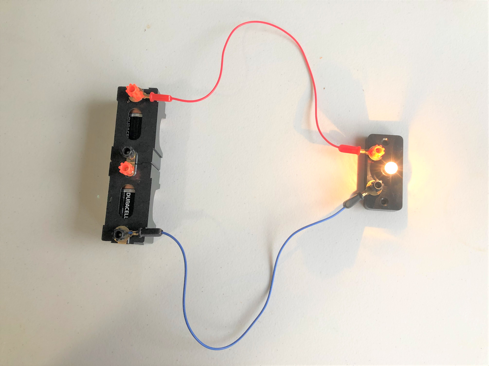
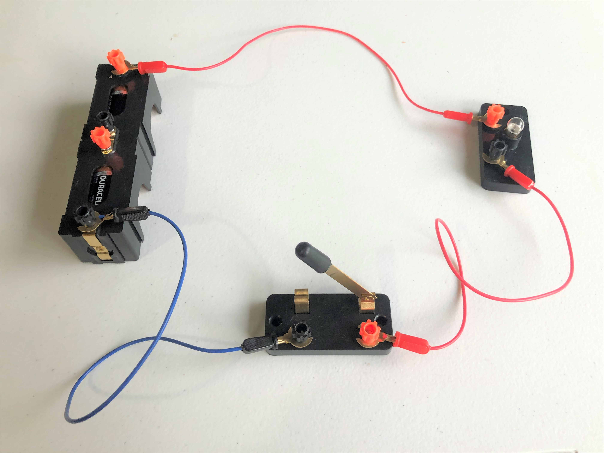
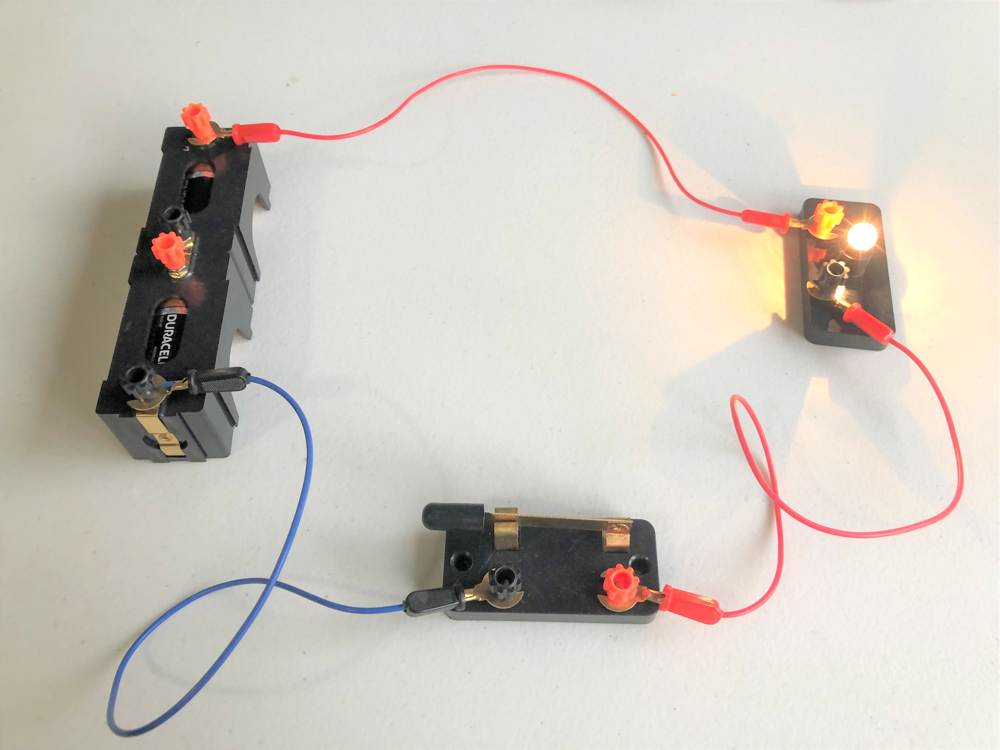
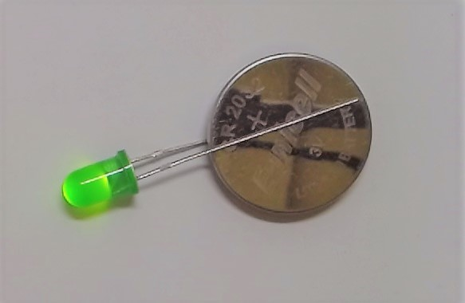
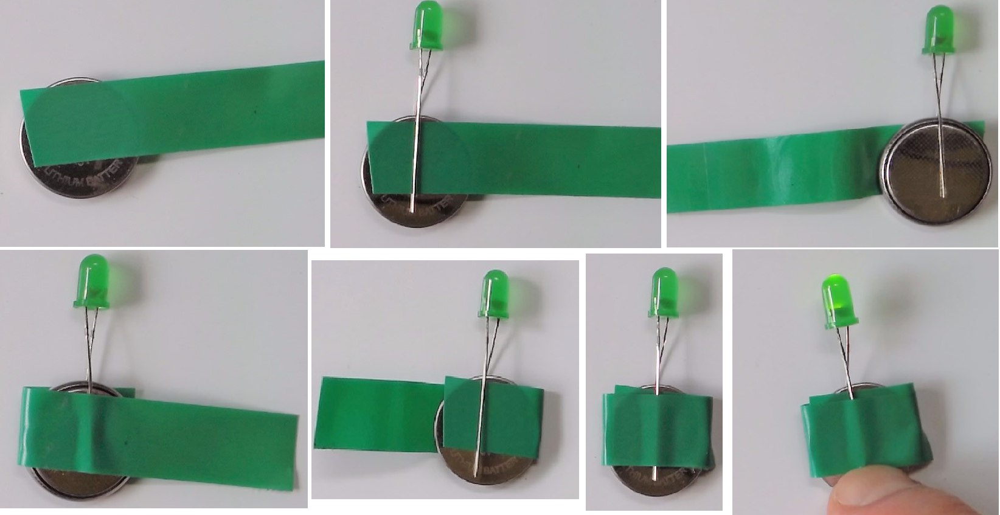

# 1. Make a Circuit.

## What is a Circuit?
An electronic circuit is a circular path of conductors by which electric current can flow.  A closed circuit is like a circle because it starts and ends at the same point forming a complete loop. Furthermore, a closed circuit allows electricity to flow from the (+) power to the (-) ground uninterrupted.

All circuits need to have three basic elements.  These elements are a voltage source, conductive path and a load.

The voltage source, such as a battery, is needed in order to cause the current to flow through the circuit.  In addition, there needs to be a conductive path that provides a route for the electricity to flow.  Finally, a proper circuit needs a load that consumes the power.  The load in the above circuit is the light bulb.
  
## Make a Circuit using an electrical circuit experiment kit

### To Do:

Using the electrical circuit experiment Kit:
1. Build a simple circuit using 2 wires, a battery and a light bulb.

3. Add a switch to your circuit.

  

## Make an LED Flashlight

### To Do:

You will need an LED, a coin battery, a button and electrical tape.
1.  Create a simple circuit by placing the coin battery between the two wires of the LED.
  NOTE: the long wire should be on the positive side of the battery
  

2. Add a button to the circuit
  - Start the tape on the + side of the battery.
  - then wrap the tape around the to the other side. This will tape the short end of the LED wire to the battery.
  - Make sure a little of the tire of the long wire extends over the tape on the + side. (add the button here)
    
  
  

Further Reading
  1. https://learn.sparkfun.com/tutorials/what-is-a-circuit/all
