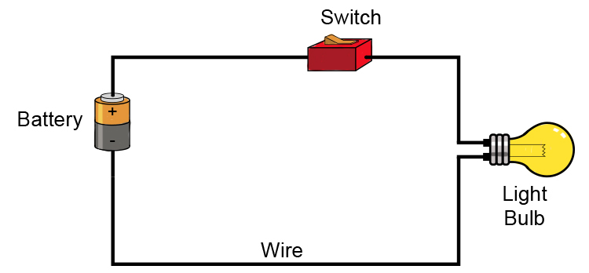

# 1 My First Circuit

## What is a Circuit?
A circuit is a closed loop that electrons can travel

All circuits need to have three basic elements.  These elements are a voltage source, conductive path and a load.

The voltage source, such as a battery, is needed in order to cause the current to flow through the circuit.  In addition, there needs to be a conductive path that provides a route for the electricity to flow.  Finally, a proper circuit needs a load that consumes the power.  The load in the above circuit is the light bulb.
  
Further Reading
  1. https://learn.sparkfun.com/tutorials/what-is-a-circuit/all
  1. https://www.georgetownisd.org/Page/21329

Create a circuit using an LED, a coin battery and electrical tape

Reference
https://www.makerspaces.com/basic-electronics/
https://mammothmemory.net/physics/electricity/simple-electrical-circuits/simple-electrical-circuits.html
