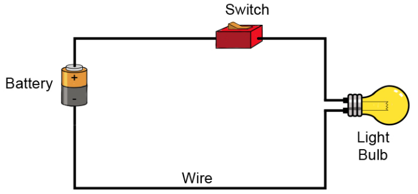
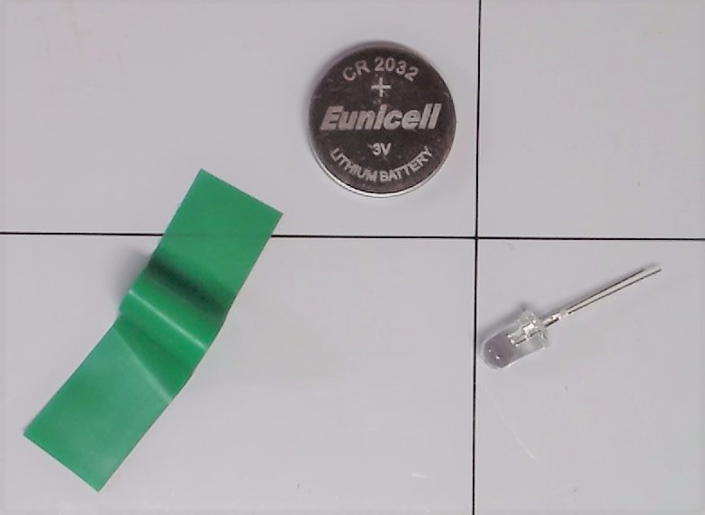
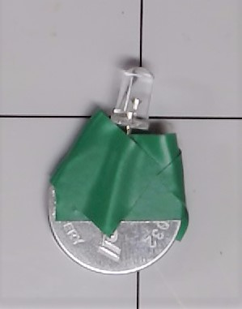
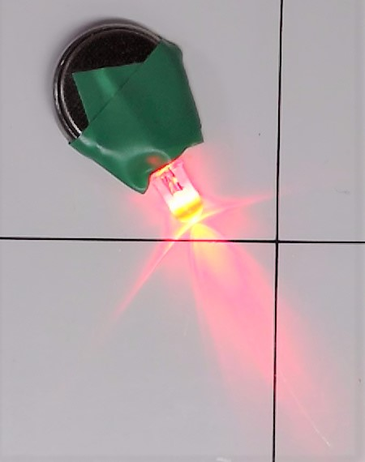

# 1. My First Circuit

## What is a Circuit?
An electronic circuit is a circular path of conductors by which electric current can flow.  A closed circuit is like a circle because it starts and ends at the same point forming a complete loop. Furthermore, a closed circuit allows electricity to flow from the (+) power to the (-) ground uninterrupted.

All circuits need to have three basic elements.  These elements are a voltage source, conductive path and a load.

The voltage source, such as a battery, is needed in order to cause the current to flow through the circuit.  In addition, there needs to be a conductive path that provides a route for the electricity to flow.  Finally, a proper circuit needs a load that consumes the power.  The load in the above circuit is the light bulb.
  
Further Reading
  1. https://www.makerspaces.com/basic-electronics/
  2. https://learn.sparkfun.com/tutorials/what-is-a-circuit/all

## Create Your First Cicuit
To create our first circuit we will be using an LED, a coin battery.

To add an on/off switch we can add some electrical tape. 

