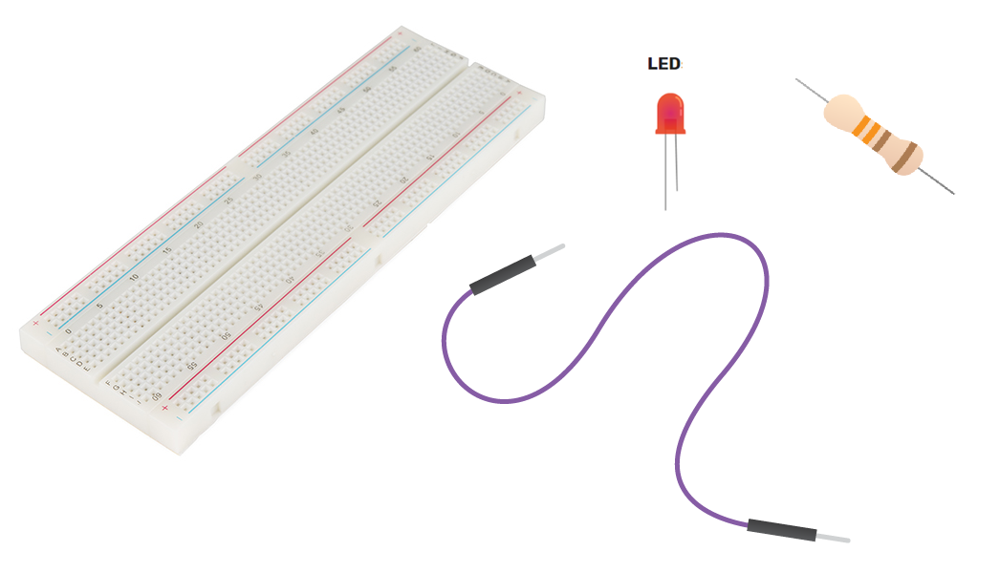

# 2. Breadboard Circuit

## Learning Objective: 
1. Understand how to use a breadboard
2. Be able to build and test a circuit on a breadboard

## What is a breadboard?
A breadboard is actually referring to a solderless breadboard. These are great units for making temporary circuits and prototyping, and they require absolutely no soldering.

Additional information https://learn.sparkfun.com/tutorials/how-to-use-a-breadboard

## Creating a circuit on a breadboard

### What you will need: 
1 Breadboard, 2 wires, 1 reisitor and 1 LED

### Creating a Circuit on a Breadboard

More on LEDs https://learn.sparkfun.com/tutorials/light-emitting-diodes-leds
