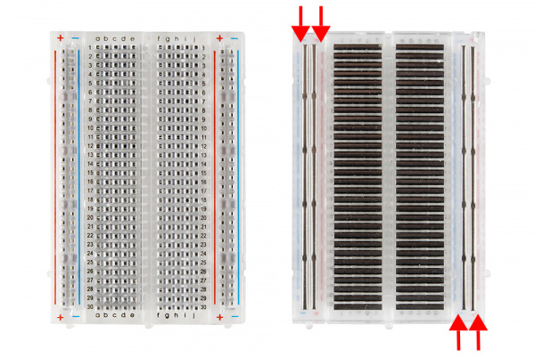

# 2 Lighting an LED

What you will need: 1 Breadboard, 2 wires, 1 reisitor and 1 LED

How to use a BreadBoard

https://learn.sparkfun.com/tutorials/how-to-use-a-breadboard

https://learn.sparkfun.com/tutorials/how-to-use-a-breadboard
https://learn.sparkfun.com/tutorials/light-emitting-diodes-leds

