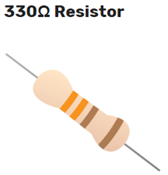

# 3 Lighting an LED using Raspberry Pi

https://projects.raspberrypi.org/en/projects/physical-computing/2

What you will need

---FlashingLED.py – python code----------------------------------------------------
from gpiozero import LED
from time import sleep

led = LED(17)

while True:
    led.on()
    sleep(1)
    led.off()
    sleep(1)

