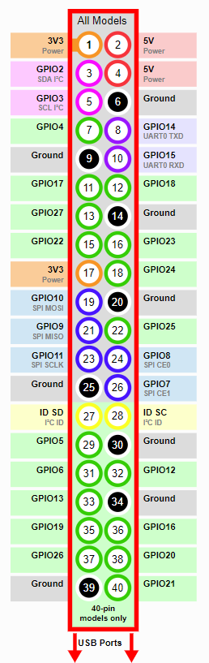
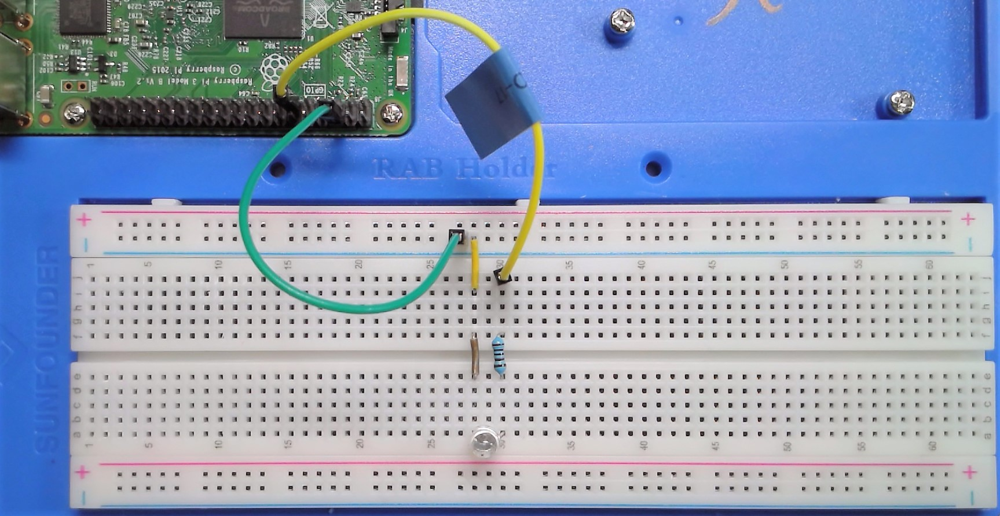

# 03 Python Programming

## Learning Objective: 
1. Introduction to Raspberry Pi and GPIO pins
2. Understand how to use Thonny Python IDE 
3. Understand and use basic Python commands (if statements, print, while loops and functions )

## Physical Computing with Python

[GPIO Pin Numbering](https://gpiozero.readthedocs.io/en/stable/recipes.html#pin-numbering)

### To Do
1. [Turn an LED on and off](https://gpiozero.readthedocs.io/en/stable/recipes.html#led)
2. [LED with variable brightness](https://gpiozero.readthedocs.io/en/stable/recipes.html#led-with-variable-brightness)
3. [Button](https://gpiozero.readthedocs.io/en/stable/recipes.html#button)
4. [Button controlled LED](https://gpiozero.readthedocs.io/en/stable/recipes.html#button-controlled-led)
5. [LEDBoard](https://gpiozero.readthedocs.io/en/stable/recipes.html#ledboard)
6. [LEDBarGraph](https://gpiozero.readthedocs.io/en/stable/recipes.html#ledbargraph)

