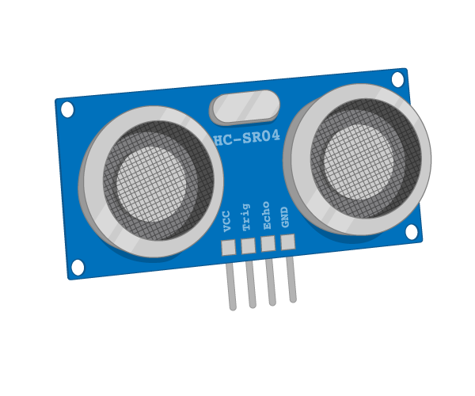

# 5. Sensors

## Learning Objective: 
1. Understand how a PIR sensor works, how to set one up and use it in a program. (Motion sensor)
2. Understand how an ultrasonic distance sensor works, how to set one up and use it in a program. (Distance sensor)
3. Understand how a Light-dependent resistors works, how to set one up and use it in a program. (Light Sensor)

  

### To Do
[Using a PIR sensor](https://projects.raspberrypi.org/en/projects/physical-computing/11)
[Using an ultrasonic distance sensor](https://projects.raspberrypi.org/en/projects/physical-computing/12)
[Using a light-dependent resistor](https://projects.raspberrypi.org/en/projects/physical-computing/10)