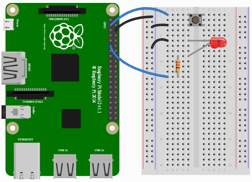
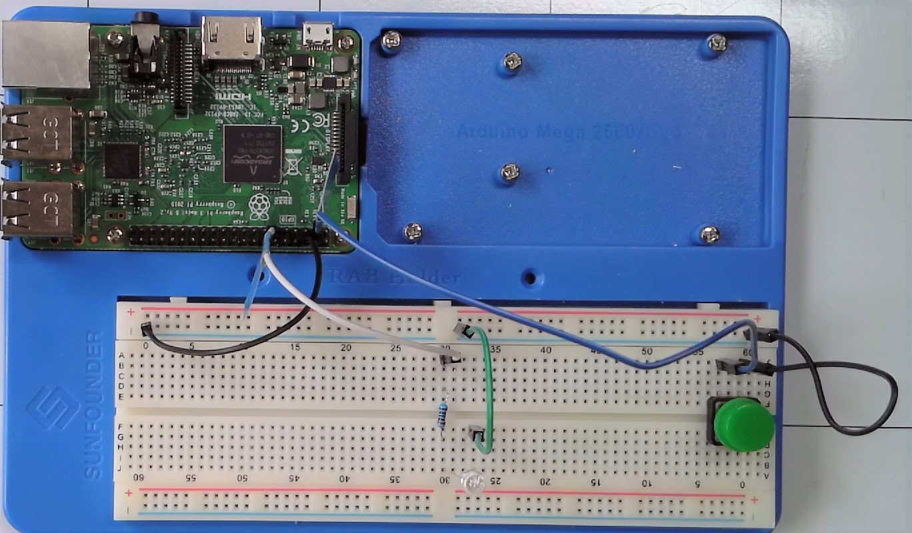

# 6 Programming a Button

https://gpiozero.readthedocs.io/en/stable/recipes.html#button-controlled-led

    from gpiozero import LED, Button
    from signal import pause

    led = LED(17)
    button = Button(2)

    button.when_pressed = led.on
    button.when_released = led.off

    pause()

