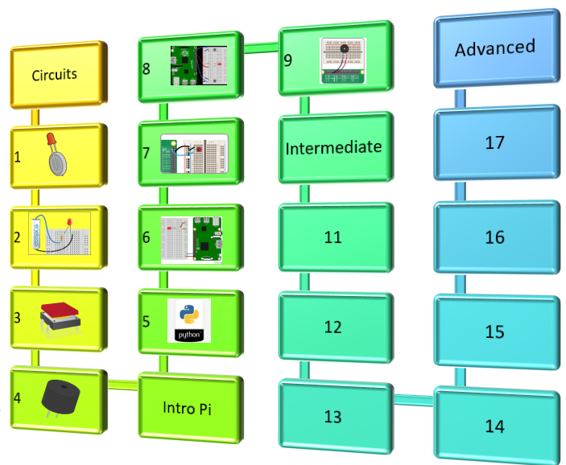

# 2021 Summer Library Pi Camp

## Introduction to Circuits and Programmming
1. [Make a Circuit](https://github.com/jetbotml/2021SummerLibrary/tree/main/01_Make_a_Curcuit)
2. [Breadboard Circuit](https://github.com/jetbotml/2021SummerLibrary/tree/main/02_Breadboard_Circuit)
3. [Python Programming](https://github.com/jetbotml/2021SummerLibrary/tree/main/03_Python_Programming)
4. [Inputs and Outputs](https://github.com/jetbotml/2021SummerLibrary/tree/main/04_Inputs_and_Outputs)
